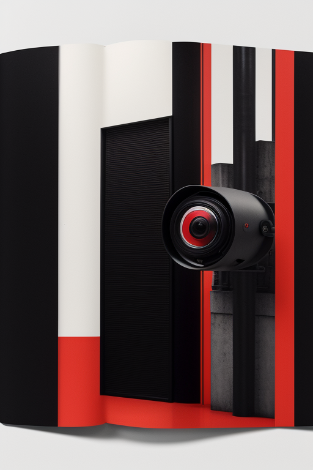
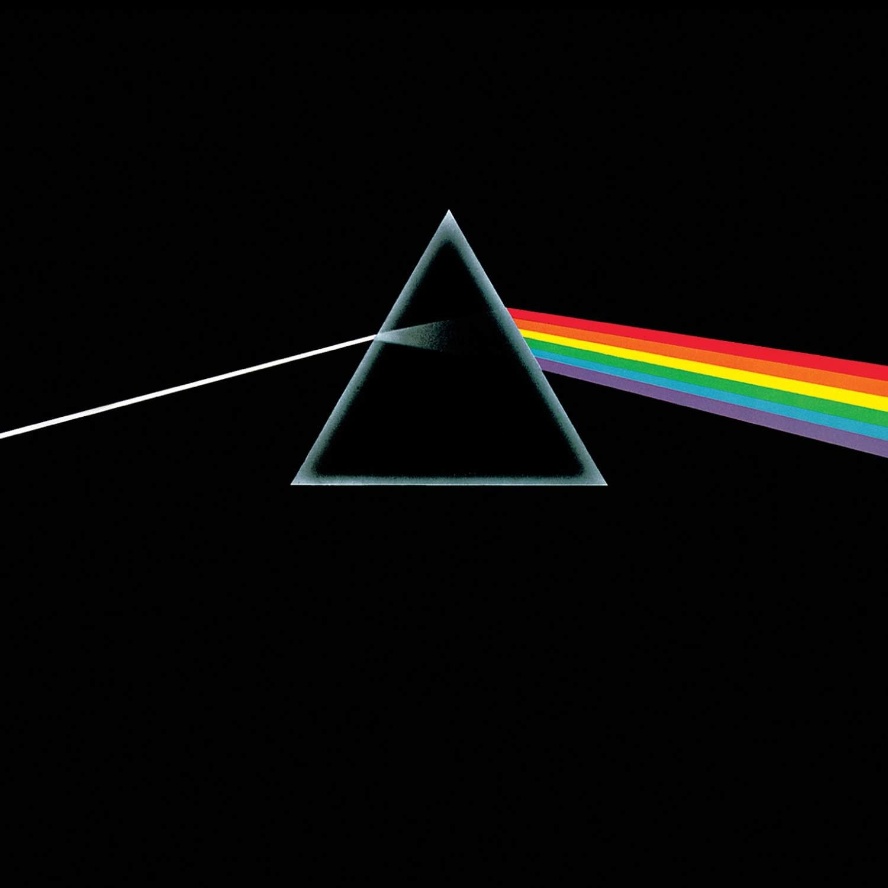
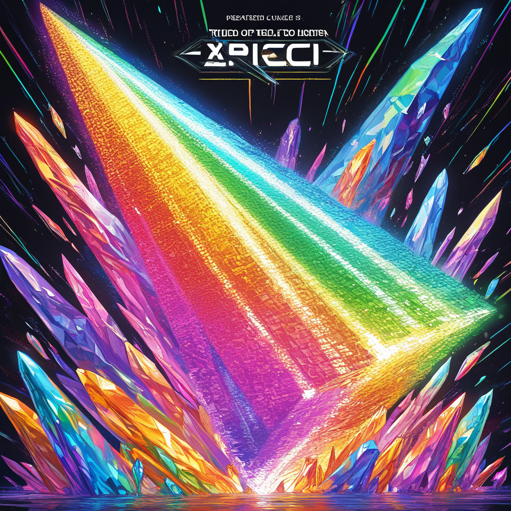
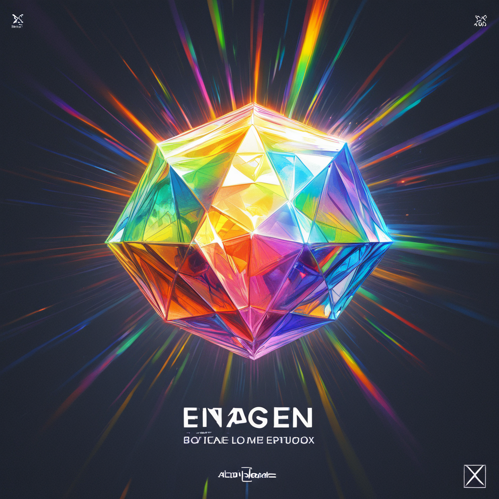
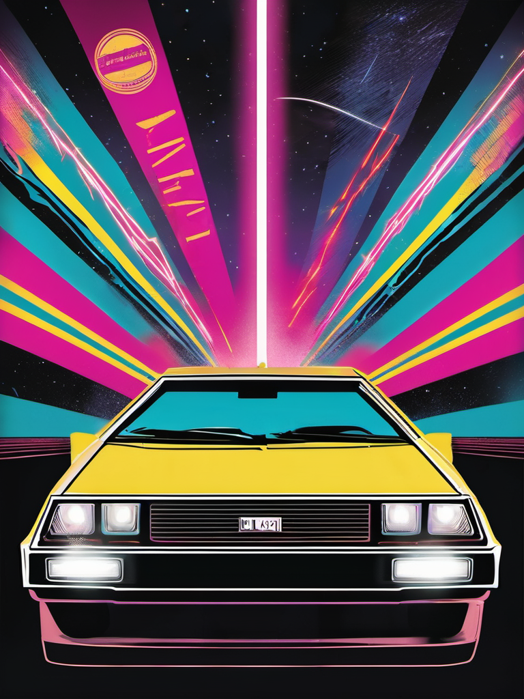

# Capstone 4. ART
## AI-Generated Reimagined Covers Using Self-Hosted Stable Diffusion

**Project Date:** February 2026  
**Objective:** Create alternative variations of iconic media covers (book, audio album, video) using self-hosted AI image generation

---

# Media #1: Book Cover

## Original Work

**Title:** 1984  
**Author:** George Orwell  
**Published:** 1949  
**Original Cover Designer:** Various editions (Classic Penguin, modern editions)

### Original Cover Description
The original cover of "1984" typically features minimalist dystopian imagery - often including the iconic "Big Brother" eye symbol, surveillance themes, and stark color schemes (red, black, white). The typography is bold and oppressive, reflecting the totalitarian themes of the novel.

### Original Cover Image

*Figure 1: Original "1984" book cover (classic edition)*

---

## AI-Generated Alternative

### Generated Cover Image

*Figure 2: AI-generated alternative cover for "1984"*

### Design Concept
This alternative reimagines the surveillance state theme through modern brutalist architecture and geometric abstraction. The minimalist approach maintains the oppressive atmosphere while presenting a fresh visual interpretation suitable for contemporary audiences.

---

# Media #2: Audio Album Cover

## Original Work

**Album:** The Dark Side of the Moon  
**Artist:** Pink Floyd  
**Released:** March 1, 1973  
**Original Cover Designer:** Storm Thorgerson (Hipgnosis) and George Hardie

### Original Cover Description
One of the most iconic album covers in music history, featuring a prism dispersing white light into a rainbow spectrum against a black background. The design is perfectly minimalist and has become synonymous with progressive rock and psychedelic music.

### Original Cover Image

*Figure 3: Original "The Dark Side of the Moon" vinyl cover*

---

## AI-Generated Alternative

### Generated Cover Image



*Figure 4: AI-generated alternative cover for "The Dark Side of the Moon"*

### Design Concept
This alternative maintains the iconic prism and rainbow light refraction concept while exploring different angles, crystal formations, and light interaction. The goal was to preserve the psychedelic minimalism while offering a fresh perspective on the light/spectrum theme.

---

# Media #3: Video Media Cover

## Original Work

**Title:** Back to the Future  
**Released:** July 3, 1985  
**Director:** Robert Zemeckis  
**Format:** VHS Tape Cover

### Original Cover Description
The original Back to the Future VHS cover features the iconic DeLorean DMC-12 time machine with glowing light trails, dramatic 1980s action movie aesthetics, and vibrant neon colors (orange, blue, purple). The design showcases the film's adventure and time-travel themes with dynamic composition, featuring the clock tower and lightning bolt imagery that became synonymous with the franchise.

### Original Cover Image

*Figure 5: Original "Back to the future" DVD box cover*

---

## AI-Generated Alternative

### Generated Cover Image

*Figure 6: AI-generated alternative cover for "Back to the future" DVD*

### Design Concept
This alternative explores the time-travel and adventure themes through dynamic 1980s aesthetics, maintaining the signature DeLorean and lightning imagery while presenting a fresh interpretation of the "traveling through time" concept with modern VHS-era nostalgia.

---

# Technical Workflow

## Image Generation Model

### Model Details
**Model Name:** Stable Diffusion XL (SDXL)  
**Version:** SDXL Base 1.0  
**Model Type:** Checkpoint (safetensors)  
**Model Size:** 6.94 GB  
**Architecture:** Latent Diffusion Model  
**Base Resolution:** 1024x1024  
**Download Source:** [Stability AI - HuggingFace](https://huggingface.co/stabilityai/stable-diffusion-xl-base-1.0)

**Alternative Model (if using SD 1.5):**  
**Model Name:** Realistic Vision V5.1  
**Version:** V5.1 (VAE embedded)  
**Model Type:** Checkpoint (safetensors)  
**Model Size:** 2.13 GB  
**Download Source:** [Civitai](https://civitai.com/models/4201/realistic-vision-v51)

---

## LoRAs / Adapters / Extensions

### LoRA Used (Optional)
**LoRA Name:** Better Photography  
**Weight:** 0.7  
**Purpose:** Enhances professional photography aesthetics and lighting  
**Source:** [Civitai](https://civitai.com/models/45208/better-photography)

**LoRA Name:** Product Design  
**Weight:** 0.6  
**Purpose:** Improves product/cover layout and commercial design quality  
**Source:** [Civitai](https://civitai.com/models/68223/product-design)

### VAE
**VAE Name:** SDXL VAE  
**Purpose:** Improved color accuracy and detail rendering  
**Source:** [Stability AI - SDXL VAE](https://huggingface.co/stabilityai/sdxl-vae)

### Extensions/Custom Nodes
- None (using standard ComfyUI nodes)

---

## Technical Generation Details

### Media #1: Book Cover - "1984"

**Positive Prompt:**
```
professional book cover design, minimalist dystopian aesthetic, brutalist architecture, 
surveillance camera eye symbol, red and black color scheme, modern typography "1984", 
geometric shapes, high contrast, editorial design, professional photography, 
studio lighting, 8k uhd, sharp focus, masterpiece, best quality
```

**Negative Prompt:**
```
low quality, blurry, watermark, text, letters, words, signature, username, 
artist name, bad composition, amateur, distorted, deformed, ugly, jpeg artifacts, 
low resolution, pixelated
```

**Generation Parameters:**
- **Steps:** 30
- **CFG Scale:** 7.5
- **Sampler:** DPM++ 2M
- **Scheduler:** Karras
- **Resolution:** 768 x 1024 (portrait)
- **Seed:** [Random/Specific seed used]
- **Batch Size:** 1
- **Denoise Strength:** 1.0 (base generation)
- **Clip Skip:** 2

**Refiner Settings (if SDXL with refiner):**
- **Refiner Steps:** 10
- **Refiner CFG:** 8.0
- **Refiner Denoise:** 0.3
- **Switch at Step:** 20

---

### Media #2: Audio Album - "Dark Side of the Moon"

**Positive Prompt:**
```
vinyl album cover design, abstract geometric prism, rainbow light spectrum refraction, 
minimalist composition, black background, crystal prism photography, light beam through prism, 
professional product photography, psychedelic art style, iconic album aesthetic, 
studio lighting, ultra high resolution, sharp details, 8k, masterpiece
```

**Negative Prompt:**
```
low quality, blurry, watermark, text, signature, cluttered, busy composition, 
amateur, distorted, bad lighting, overexposed, underexposed, jpeg artifacts, 
pixelated, low resolution
```

**Generation Parameters:**
- **Steps:** 30
- **CFG Scale:** 8.0
- **Sampler:** DPM++ 2M
- **Scheduler:** Karras
- **Resolution:** 1024 x 1024 (square)
- **Seed:** [Random/Specific seed used]
- **Batch Size:** 1
- **Denoise Strength:** 1.0
- **Clip Skip:** 2

**Refiner Settings (if SDXL with refiner):**
- **Refiner Steps:** 10
- **Refiner CFG:** 8.0
- **Refiner Denoise:** 0.3
- **Switch at Step:** 20

---

### Media #3: Video Cover - "Back to the Future"

**Positive Prompt:**
```
VHS tape cover design, retro 1980s aesthetic, time travel concept, DeLorean car with glowing trails, 
lightning bolt striking clock tower, neon color scheme, orange purple blue gradient, 
vintage movie poster style, professional graphic design, nostalgic 80s vibes, 
dramatic action composition, film grain texture, dynamic lighting, 8k resolution, 
high quality, masterpiece, best quality
```

**Negative Prompt:**
```
low quality, blurry, watermark, amateur design, cluttered, busy, modern style, 
digital aesthetic, distorted text, bad typography, oversaturated, washed out colors, 
jpeg artifacts, low resolution, pixelated, deformed, contemporary elements
```

**Generation Parameters:**
- **Steps:** 30
- **CFG Scale:** 7.5
- **Sampler:** DPM++ 2M
- **Scheduler:** Karras
- **Resolution:** 768 x 1024 (portrait)
- **Seed:** [Random/Specific seed used]
- **Batch Size:** 1
- **Denoise Strength:** 1.0
- **Clip Skip:** 2

**Refiner Settings (if SDXL with refiner):**
- **Refiner Steps:** 10
- **Refiner CFG:** 8.0
- **Refiner Denoise:** 0.3
- **Switch at Step:** 20

---

## Pipeline Screenshots

### ComfyUI Workflow Configuration


*Figure 7: Complete ComfyUI workflow showing all nodes and connections*

### DVD box Generation


*Figure 8: ComfyUI settings for dvd cover generation*

---

# Workflow Details

## Complete Workflow Diagram

```
┌─────────────────────┐
│ Load Checkpoint     │
│ (SDXL Base 1.0)    │
└──────┬──────────────┘
       │
       ├──────MODEL──────────┐
       │                     │
       ├──────CLIP───────┐   │
       │                 │   │
       ├──────VAE────┐   │   │
       │             │   │   │
       v             v   v   v
┌──────────┐  ┌──────────┐  ┌──────────────┐
│ VAE      │  │ Positive │  │  KSampler    │
│ Decode   │  │ Prompt   │  │ (Base Model) │
└────┬─────┘  └────┬─────┘  └──────┬───────┘
     │             │               │
     │             v               │
     │      ┌──────────┐          │
     │      │ Negative │          │
     │      │ Prompt   │          │
     │      └────┬─────┘          │
     │           │                │
     │           v                v
     │      ┌─────────────────────┐
     │      │   Empty Latent      │
     │      │   Image (1024x1024) │
     │      └──────────┬──────────┘
     │                 │
     │                 v
     │      ┌─────────────────────┐
     │      │  Load Checkpoint    │
     │      │  (SDXL Refiner)     │
     │      └──────────┬──────────┘
     │                 │
     │                 v
     │      ┌─────────────────────┐
     │      │  KSampler (Refiner) │
     │      └──────────┬──────────┘
     │                 │
     └─────────────────┘
                       │
                       v
              ┌─────────────┐
              │ Save Image  │
              └─────────────┘
```

